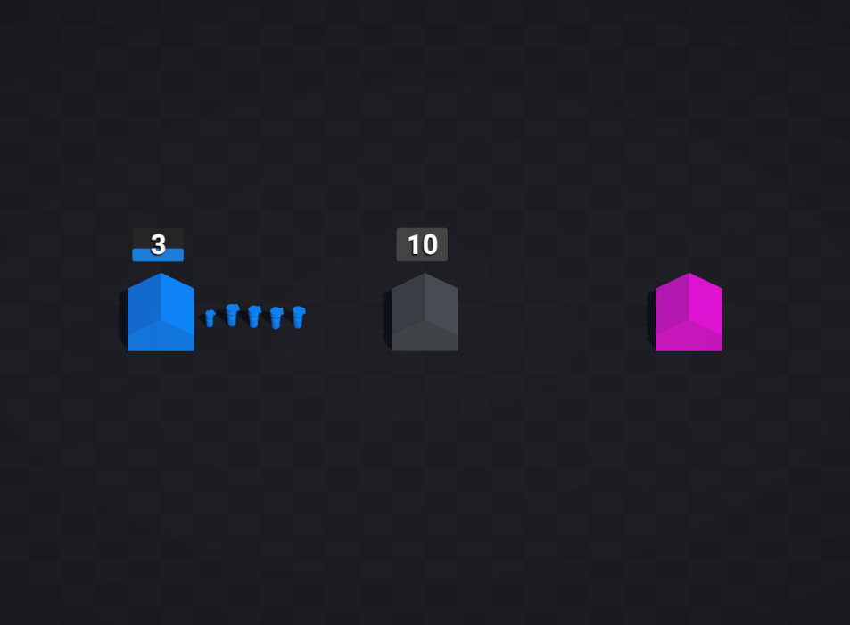

# Minimalists

## Description
Capture nodes, stockpile units, and decide when to upgrade Houses or convert them into Turrets or Helipads. Houses fuel production; Turrets hold ground; well-timed pushes punish openings. The AI reacts dynamically to the board—reinforcing, upgrading, converting, and attacking—without scripted waves.

## How to Play
- Select a node you own, then click another to capture or reinforce.
- Upgrade when you’ve banked enough units for a stronger construct.
- Convert Houses into Turrets or Helipads to shift your tactics.
- Win by being the last faction standing.

## Features
- Minimalistic real-time strategy focusing on three construct types: Houses, Turrets, and Helipads.
- Dynamic AI that evaluates the board and reacts in real time.
- Simple controls and quick matches suited for rapid gameplay sessions.

## Technologies
- Unity 3D
- Finite State Machines
- AI Behaviour
- Level Design

## Repository Structure
- `Assets/` – Game assets, scripts, and scenes.
- `Packages/` – Unity package configuration.
- `ProjectSettings/` – Unity project settings.
